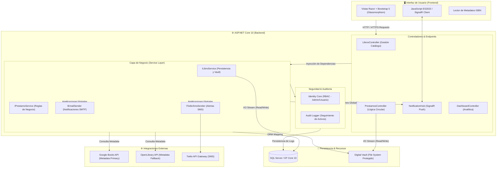

# 🏛️ BibliotecaMVC: Sistema de Gestión de Vanguardia

[](https://dotnet.microsoft.com/download)
[](https://docs.microsoft.com/ef/core/)
[](https://dotnet.microsoft.com/apps/aspnet/signalr)
[](LICENSE)

**BibliotecaMVC** es un ecosistema digital de vanguardia diseñado para la gestión de activos bibliográficos de alto rendimiento. Combina una arquitectura desacoplada en **ASP.NET Core 10** con una interfaz ultra-moderna basada en **Glassmorphism**, ofreciendo una experiencia reactiva y segura para la era digital.

---

## 🏗️ Arquitectura Técnica Detallada

El sistema implementa una **Arquitectura en Capas** reforzada con el patrón de Inyección de Dependencias, garantizando un mantenimiento modular y escalabilidad horizontal.



---

## 🌟 Características de Élite

### 1. 🧬 Inteligencia de Datos ISBN (Resiliencia Multi-Capa)
Motor de autocompletado inteligente con estrategia de fallback:
- **Google Books Primary**: Recupera títulos, autores, categorías y portadas de alta resolución.
- **OpenLibrary Fallback**: Garantiza la disponibilidad de metadatos incluso si las cuotas de Google se agotan.
- **Normalización Inteligente**: Sanitización de ISBNs y manejo de descripciones estructuradas para evitar errores de renderizado.

### 2. 🛡️ Bóveda Digital Segura (Vault System)
- **Segregación Física**: Los archivos (`BibliotecaLibros_Vault`) se almacenan fuera del `wwwroot`, impidiendo el acceso directo por URL.
- **DRM Proactivo**: El acceso a los archivos digitales requiere un préstamo activo validado en tiempo real.
- **Auditoría de Activos**: Cada lectura o descarga genera un log de auditoría con IP, fecha y usuario.

### 3. 📊 Ecosistema en Tiempo Real
- **SignalR Push Engine**: Alertas instantáneas al dashboard administrativo y notificaciones de usuario.
- **Omnicanalidad**: Notificaciones vía **Twilio SMS** (con soporte para WhatsApp) y **SMTP Transaccional**.
- **Analítica Visual**: Dashboards dinámicos con Chart.js para monitoreo de morosidad y popularidad.

---

## 🛠️ Stack Tecnológico

| Capa | Tecnologías |
| :--- | :--- |
| **Backend** | .NET 10.0, C# 13, SignalR, Identity Core |
| **Persistencia** | SQL Server (Express), EF Core 10 (Migrations) |
| **Frontend** | Bootstrap 5, JS ES2022, Animate.css, Chart.js |
| **Servicios** | Twilio API, Google Books API, OpenLibrary API |

---

## 🚀 Instalación y Configuración

### 1. Requisitos Previos
- [.NET 10 SDK](https://dotnet.microsoft.com/download)
- **SQL Server Express** (Instancia local `.\SQLEXPRESS`)

### 2. Despliegue Inicial
```bash
git clone https://github.com/dagomezpulid/BibliotecaMVC.git
cd BibliotecaMVC
dotnet restore
```

### 3. Configuración de Secretos (Crítico)
Para que el sistema funcione correctamente (especialmente en entornos nuevos), configura los **User Secrets**:

```bash
dotnet user-secrets init

# Administrador Inicial (Se creará al arrancar la app)
dotnet user-secrets set "AdminSettings:Email" "tu-email@ejemplo.com"
dotnet user-secrets set "AdminSettings:Password" "TuPasswordSeguro123!"

# Twilio (SMS/WhatsApp)
dotnet user-secrets set "TwilioSettings:AccountSid" "tu_sid"
dotnet user-secrets set "TwilioSettings:AuthToken" "tu_token"
dotnet user-secrets set "TwilioSettings:FromPhoneNumber" "+123456789"

# Email (SMTP Transaccional)
dotnet user-secrets set "EmailSettings:SmtpServer" "smtp.gmail.com"
dotnet user-secrets set "EmailSettings:Port" "587"
dotnet user-secrets set "EmailSettings:Username" "tu-email@gmail.com"
dotnet user-secrets set "EmailSettings:Password" "tu-app-password"
```

### 4. Base de Datos y Ejecución
```bash
dotnet ef database update
dotnet run
```

---

## ⚠️ Solución de Problemas (Troubleshooting)

### Error: "Error al crear el libro o el título ya existe" en nuevos PCs
Si al intentar agregar un libro recibes este error a pesar de que el título es nuevo, verifica los **permisos de carpeta**:
- El servidor necesita permisos de **Escritura** en la carpeta raíz del proyecto para crear la carpeta `BibliotecaLibros_Vault`.
- Si ejecutas desde IIS Express o Kestrel, asegúrate de que el proceso tenga acceso a la ruta física.

---

## 📁 Estructura del Proyecto

- `Controllers`: Endpoints desacoplados de la lógica de negocio.
- `Services`: Implementaciones de `ILibroService` y `IPrestamoService`.
- `Models`: Entidades POCO con anotaciones de validación y Fluent API.
- `Hubs`: WebSocket endpoints para notificaciones real-time.
- `BibliotecaLibros_Vault`: Almacenamiento seguro de archivos digitales (Generado automáticamente).

---

## 👨‍💻 Contribuciones
Este proyecto es una muestra de ingeniería de software moderna con enfoque en seguridad y experiencia de usuario. ¡Pull requests son bienvenidos!
