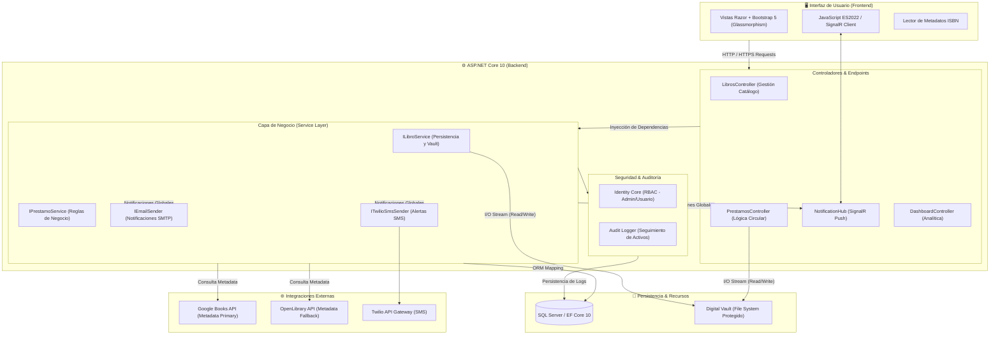

# 🏛️ BibliotecaMVC: Sistema de Gestión de Vanguardia

[](https://dotnet.microsoft.com/download)
[](https://docs.microsoft.com/ef/core/)
[](https://dotnet.microsoft.com/apps/aspnet/signalr)
[](LICENSE)

**BibliotecaMVC** no es solo un gestor de libros; es un ecosistema digital diseñado para bibliotecas de alto rendimiento. Combina una arquitectura robusta en **ASP.NET Core 10** con una interfaz ultra-moderna inspirada en el **Glassmorphism** y una experiencia de usuario fluida y reactiva.

---

## 🏗️ Arquitectura Técnica Detallada

El sistema sigue un patrón de **Arquitectura en Capas** con desacoplamiento mediante inyección de dependencias, lo que permite una escalabilidad y mantenimiento superior.



---

## 🌟 Características de Élite

### 1. 🧬 Inteligencia de Datos ISBN (Multi-Servicio)
El corazón del registro de libros ahora cuenta con una estrategia de **búsqueda persistente multi-capa**:
- **Google Books API Integration**: Recuperación automática de metadatos técnicos (sinopsis, autores, categorías).
- **OpenLibrary Fallback**: Si Google Books no responde o tiene límites de cuota, el sistema alterna inteligentemente a OpenLibrary para asegurar el autocompletado.
- **Normalización Agresiva**: Limpieza automática de ISBNs (guiones, espacios, caracteres especiales) para una precisión del 100%.

### 2. 🛡️ Bóveda Digital y DRM (Digital Rights Management)
Seguridad absoluta para tus activos digitales:
- **Digital Vault**: Almacenamiento físico segregado (`BibliotecaLibros_Vault`) fuera de la raíz web para prevenir accesos directos.
- **Auditoría Proactiva**: Registro detallado de quién, cuándo y desde qué IP se descarga o lee un libro digital.
- **Streaming de Contenido**: Visor inmersivo que sirve archivos directamente desde la bóveda con soporte para rangos de bytes.

### 3. 📊 Dashboard Predictivo y Real-Time
- **SignalR Push Engine**: Notificaciones en tiempo real sobre préstamos próximos a vencer y nuevas adquisiciones.
- **Visualización con Chart.js**: Gráficos dinámicos que analizan la rotación del catálogo y preferencias de los lectores.
- **Notificaciones Multi-Canal**: Integración nativa con **Twilio SMS** y envío de correos electrónicos transaccionales.

---

## 🛠️ Stack Tecnológico

| Capa | Tecnologías |
| :--- | :--- |
| **Backend** | .NET 10.0, C# 13, SignalR, Identity Core |
| **Persistencia** | SQL Server, Entity Framework Core 10 (Code First) |
| **Frontend** | Bootstrap 5, JavaScript ES2022, Animate.css, Chart.js |
| **Servicios** | Twilio SMS API, Google Books API, OpenLibrary API |
| **Arquitectura** | Service Layer, Repository Pattern (Lite), Audit Logging |

---

## 🚀 Instalación Rápida

1. **Clonar y Restaurar**:
   ```bash
   git clone https://github.com/dagomezpulid/BibliotecaMVC.git
   cd BibliotecaMVC
   dotnet restore
   ```

2. **Configuración de Secretos**:
   Para evitar exponer información sensible en `appsettings.json`, utiliza la herramienta de **User Secrets**:

   ```bash
   dotnet user-secrets init
   dotnet user-secrets set "AdminEmail" "admin@biblioteca.com"
   dotnet user-secrets set "AdminPassword" "TuPasswordSeguro123!"
   dotnet user-secrets set "Twilio:AccountSid" "tu_sid"
   dotnet user-secrets set "Twilio:AuthToken" "tu_token"
   dotnet user-secrets set "Twilio:FromNumber" "tu_numero"
   dotnet user-secrets set "EmailSettings:SmtpServer" "smtp.gmail.com"
   dotnet user-secrets set "EmailSettings:Port" "587"
   dotnet user-secrets set "EmailSettings:Username" "tu-email@gmail.com"
   dotnet user-secrets set "EmailSettings:Password" "tu-app-password"
   ```

3. **Base de Datos**:
   Las migraciones están listas. Ejecuta:
   ```bash
   dotnet ef database update
   ```

4. **Ejecutar**:
   ```bash
   dotnet run
   ```

---

## 📁 Estructura del Proyecto

- `BibliotecaMVC/Services`: Lógica de negocio pura (Préstamos, Libros, SMS, Email).
- `BibliotecaMVC/Hubs`: Canales de comunicación SignalR.
- `BibliotecaMVC/Models`: Entidades ricas y auditoría de logs.
- `BibliotecaLibros_Vault`: Carpeta protegida para PDFs y EPUBs (se crea automáticamente).

---

## 👨‍💻 Contribuciones
Este proyecto es una muestra de ingeniería de software moderna. Siéntete libre de clonarlo y proponer mejoras en la capa de IA o integración de lectores PDF.js avanzados.

**Desarrollado con ❤️ para la comunidad de ASP.NET**
