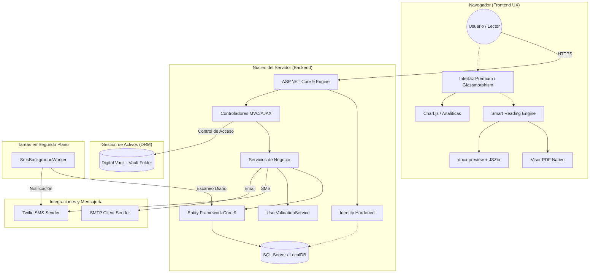

# 📚 BibliotecaMVC: Centro de Gestión Bibliográfica de Vanguardia

[](https://dotnet.microsoft.com/download)
[](https://docs.microsoft.com/ef/)
[](file:///c:/Repos/BibliotecaMVC)
[](file:///c:/Repos/BibliotecaMVC)

**BibliotecaMVC** es una plataforma de gestión bibliotecaria de alta gama que redefine la experiencia de préstamo digital. Diseñada bajo un estándar de **Estética Industrial**, integra analíticas avanzadas, un motor de lectura inteligente de última generación y una arquitectura de seguridad robusta para el manejo de activos digitales.

---

## ✨ Características Premium

### 🎨 1. Estética Industrial y UX Adaptativa
*   **Diseño de Vanguardia**: Implementación de **Glassmorphism** (Efecto Cristal) en tarjetas de libros para una profundidad visual superior que detecta y se adapta al tema actual.
*   **Modo Oscuro Dinámico**: Interfaz 100% armonizada mediante variables CSS y `backdrop-filter`. Los componentes cambian orgánicamente basándose en las preferencias del sistema o del usuario.
*   **Diferenciación de Interacción**: Jerarquía visual clara entre "Acciones" (botones sólidos, `rounded-3`) y "Estados" (badges de cápsula, traslúcidos), eliminando la carga cognitiva.

### 📊 2. Inteligencia de Negocio y Analíticas
*   **Insights en Tiempo Real**: Dashboards administrativos potenciados por `Chart.js` con **Reactividad de Tema**: las gráficas se redibujan instantáneamente al alternar entre modo claro y oscuro para mantener legibilidad absoluta.
*   **Tendencias de Préstamos**: Análisis gráfico de la actividad mensual con gradientes dinámicos para una interpretación visual rápida.
*   **Control de Morosidad**: Monitorización dual (Monto vs Días) mediante gráficos de barras horizontales de alto contraste.

### 📖 3. Smart Reading Engine con Soporte Multi-Formato
*   **Lector de Word (.docx) Nativo**: Integración de vanguardia con `docx-preview` que permite renderizar documentos de Word directamente en el navegador con estética de "hoja física", sin necesidad de descargas externas.
*   **Visor de PDF Inmersivo**: Experiencia de lectura fluida que guarda automáticamente la página exacta donde se detuvo el usuario, sincronizando el progreso de forma persistente.
*   **Búsqueda Inteligente (AJAX)**: Filtrado en tiempo real sin recarga de página por título, autor o categoría, garantizando una exploración fluida.
*   **Navegación Centralizada**: El sistema utiliza el Catálogo de Libros como eje central, asegurando que todos los botones de retorno y accesos directos lleven al corazón del ecosistema.

### 🔔 4. Centro de Notificaciones y Mensajería
*   **Centro de Alertas**: Un buzón de notificaciones inteligente que informa sobre multas y préstamos. Incluye marcado asíncrono de lectura para una experiencia sin interrupciones.
*   **Notificaciones Omnicanal**: Integración nativa con **Twilio SMS** para alertas críticas enviadas automáticamente por el sistema de patrullaje nocturno.
*   **Feedback Inmediato**: Sistema de alertas (Success/Error) auto-desvanecibles tipo "Toast" que mantienen la limpieza de la interfaz.

### 🛡️ 5. Ingeniería de Software y Seguridad Profesional
*   **Documentación Técnica Profunda**: El proyecto cuenta con una [Explicación Médula de la Lógica](file:///C:/Users/DanielGomezPulido/.gemini/antigravity/brain/56c756d6-fae1-4809-8eb2-f00de0ca3b69/explicacion_logica_proyecto.md) que detalla el funcionamiento interno de préstamos, multas y seguridad.
*   **Auditoría de Seguridad (IDOR/CSRF)**: Implementación de validaciones estrictas de propiedad de datos en acciones transaccionales y protección endurecida contra ataques de falsificación de peticiones.
*   **Integridad Relacional**: Lógica avanzada de borrado que valida la coexistencia de registros y migraciones a "usuarios fantasma" para preservar la integridad de las analíticas históricas.

---

## 🏛️ Arquitectura del Ecosistema



---

## 🛠️ Stack Tecnológico
*   **Backend**: C# 13, ASP.NET Core 9.0, Entity Framework Core 9.
*   **Frontend**: Bootstrap 5, JavaScript ES2022, Chart.js, **docx-preview + JSZip**.
*   **Cloud**: Twilio SMS API para notificaciones transaccionales automáticas.
*   **Seguridad**: Identity con políticas de bloqueo, PhysicalFile Streaming para DRM y validaciones de IDOR multi-nivel.
*   **Estándar**: Documentación XML Integral y Clean Code Architecture.

---

## 💻 Guía de Despliegue y Configuración

### 1. Gestión de Secretos
El sistema protege tus credenciales críticas mediante `dotnet user-secrets`. Configura tus llaves antes de iniciar:

```powershell
# Iniciar gestión de secretos en el proyecto
dotnet user-secrets init

# Configuración Administrativa
dotnet user-secrets set "AdminSettings:Email" "admin@bibliotecamvc.com"
dotnet user-secrets set "AdminSettings:Password" "TuPasswordSeguro123!"

# Configuración Twilio (SMS)
dotnet user-secrets set "TwilioSettings:AccountSid" "ACXXXXXXXXXX"
dotnet user-secrets set "TwilioSettings:AuthToken" "tu_token_aqui"
dotnet user-secrets set "TwilioSettings:FromPhoneNumber" "+123456789"
```

### 2. Inicialización del Ecosistema
```powershell
# Aplicar esquema de base de datos
dotnet ef database update

# Ejecutar el servidor
dotnet run
```

---

## 📁 Estructura de la Solución
*   **BibliotecaLibros_Vault/**: Repositorio físico protegido (DRM) fuera de la ruta pública.
*   **Services/**: Motores de SMS, Notificaciones y Lógica de Negocio.
*   **Controllers/**: Flujos de Administración, Préstamos y Catálogo AJAX.
*   **Views/Prestamos/Leer.cshtml**: Corazón del motor de lectura multi-formato.

---

> [!IMPORTANT]
> **Aviso de Cumplimiento**: Esta plataforma implementa validaciones de seguridad multicapa (IDOR, CSRF) y un diseño orientado a la excelencia operacional.

*Desarrollado con arquitectura premium y pasión tecnológica.*
SRF) y un diseño orientado a la excelencia operacional.

*Desarrollado con arquitectura premium y pasión tecnológica.*
