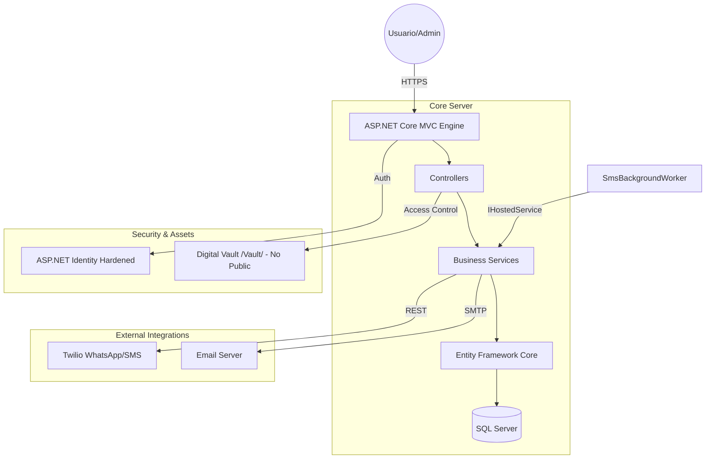

# 📚 BibliotecaMVC: Ecosistema de Gestión Bibliográfica Premium

[](https://dotnet.microsoft.com/download)
[](https://docs.microsoft.com/ef/)
[](file:///c:/Repos/BibliotecaMVC)

**BibliotecaMVC** no es solo un gestor de préstamos; es un ecosistema digital diseñado bajo estándares industriales de **Clean Code**, **Seguridad Ofensiva** y **Arquitectura de Micro-servicios Simulada**. Proporciona una solución integral para la digitalización de bibliotecas, integrando mensajería omnicanal y gestión segura de activos.

---

## 🏛️ Arquitectura del Sistema

El sistema utiliza una arquitectura **Model-View-Controller (MVC)** robusta, desacoplando la lógica de negocio del servidor de la presentación y los datos.



---

## 🛠️ Stack Tecnológico de Ingeniería

### **Core Backend**
- **Framework**: .NET 10.0 con C# 12+.
- **ORM**: Entity Framework Core 10 con **Fluent API** para relaciones complejas.
- **Base de Datos**: SQL Server (optimizado con índices y claves foráneas).
- **Control de Concurrencia**: Implementación de **Tokens de Transacción (`RowVersion`)** para evitar la sobreventa de stock en accesos simultáneos.

### **Seguridad y DRM**
- **Protocolo Identity**: Autenticación reforzada con política de **Lockout** (bloqueo tras 5 intentos fallidos) y requerimientos de complejidad de contraseña (Non-Alphanumeric).
- **Vault System**: Los libros digitales se almacenan en una carpeta física fuera del directorio público (`wwwroot`). El acceso solo es posible a través de un controlador que verifica los derechos de préstamo en tiempo real.

### **Comunicación & Automatización**
- **Omnicanalidad**: Despacho de notificaciones vía **WhatsApp Business API** (mediante Twilio) y **SMTP Transaccional**.
- **Background Computing**: `SmsBackgroundWorker` patrulla la base de datos cada 24 horas para detectar morosidad de forma proactiva.

---

## ✨ Características de Alto Nivel

### 1. 🛡️ Blindaje de Usuarios e Identidad
- **Amnistía Administrativa**: Los administradores pueden desbloquear usuarios suspendidos tras conciliaciones manuales.
- **Protección de Cuenta Raíz**: El sistema impide la eliminación del administrador principal configurado en los secretos del servidor.

### 2. 📖 Motor Digital Evolucionado
- **Visor Inmersivo**: Renderizado de documentos PDF y EPUB directamente en el navegador con túneles de lectura seguros.
- **Motor de Recomendaciones**: Algoritmo que analiza categorías y autores para sugerir lecturas relacionadas (Fase 4).
- **Búsqueda Segmentada**: Filtrado dinámico por ISBN, Autor o Categoría con paginación en servidor para escalabilidad masiva.

### 3. 🔄 Ciclo de Préstamo Inteligente
- **Cálculo Automático de Mora**: Peritaje en tiempo real de los días de retraso y generación inmediata de multas financieras.
- **Validación Multicapa**: Control de stock, deudas pendientes y límites de préstamos activos (Máx. 3) antes de confirmar la renta.

---

## 💻 Guía de Despliegue Técnico

### 1. Configuración de Secretos (Indispensable)
El proyecto utiliza **Secret Management** para proteger credenciales. Ejecute estos comandos en su terminal de desarrollo:

```powershell
# Iniciar gestión de secretos
dotnet user-secrets init

# Configuración de Identidad Administrativa
dotnet user-secrets set "AdminSettings:Email" "tu_admin@ejemplo.com"
dotnet user-secrets set "AdminSettings:Password" "PasswordMuyFuerte123!"

# Configuración Twilio (WhatsApp/SMS)
dotnet user-secrets set "TwilioSettings:AccountSid" "ACXXXXXXXXXXXXX"
dotnet user-secrets set "TwilioSettings:AuthToken" "tu_auth_token"
dotnet user-secrets set "TwilioSettings:FromPhoneNumber" "+123456789"

# Configuración SMTP (Email)
dotnet user-secrets set "EmailSettings:Username" "tu_smtp_user"
dotnet user-secrets set "EmailSettings:Password" "tu_smtp_password"
```

### 2. Inicialización de Datos
```powershell
# Aplicar Migraciones de EF Core y Seeding de Categorías
dotnet ef database update

# Ejecutar Proyecto
dotnet run
```

---

## 📁 Estructura del Proyecto

```text
BibliotecaMVC/
├── Areas/Identity        # Personalización de ASP.NET Core Identity
├── Controllers/          # Lógica de flujo (Admin, Prestamos, Multas, etc.)
├── Models/               # Entidades de Dominio y ViewModels optimizados
├── Services/             # Lógica de Negocio (Twilio, Email, Workers)
├── ViewComponents/       # Componentes de UI desacoplados (e.g., Alerta de Multas)
├── Views/                # Vistas Razor con diseño responsivo premium
└── wwwroot/              # Activos estáticos (CSS, JS, Imágenes)
```

---

> [!IMPORTANT]
> **Nota sobre Seguridad**: Esta aplicación implementa protección contra ataques de **IDOR** (Insecure Direct Object Reference) en la gestión de libros y **CSRF** en todos los formularios transaccionales.

*Desarrollado con pasión técnica por Daniel Gómez Pulido.*
