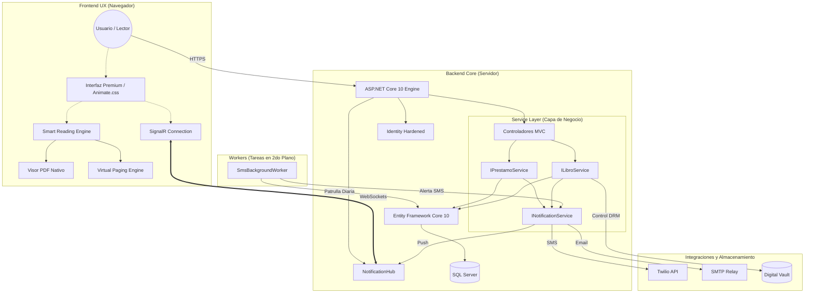

# 📚 BibliotecaMVC: Centro de Gestión Bibliográfica de Vanguardia

[](https://dotnet.microsoft.com/download)
[](https://docs.microsoft.com/ef/)
[](file:///c:/Repos/BibliotecaMVC)
[](file:///c:/Repos/BibliotecaMVC)

**BibliotecaMVC** es una plataforma de gestión bibliotecaria de alta gama que redefine la experiencia de préstamo digital. Diseñada bajo un estándar de **Estética Industrial**, integra analíticas avanzadas, un motor de lectura inteligente de última generación y una arquitectura de servicios desacoplada para una robustez de nivel empresarial.

---

## ✨ Características Premium

### 🎨 1. Estética Industrial y UX Adaptativa
*   **Diseño de Vanguardia**: Implementación de **Glassmorphism** (Efecto Cristal) y micro-animaciones dinámicas con **Animate.css**.
*   **Botones Premium de Navegación**: Sistema de navegación administrativo unificado con botones de efecto cristal y feedback háptico visual.
*   **Modo Oscuro Dinámico**: Interfaz 100% armonizada mediante variables CSS. Los componentes cambian orgánicamente basándose en las preferencias del sistema.
*   **Feedback Visual Real**: La campana de notificaciones reacciona físicamente (efecto *swing*) ante nuevos eventos en tiempo real.

### 🚀 2. Notificaciones en Tiempo Real (SignalR)
*   **Push Engine**: Integración con **SignalR** para la entrega inmediata de alertas sin necesidad de recarga de página.
*   **Reactividad Instantánea**: Los contadores de multas, préstamos y notificaciones se actualizan en el acto al producirse cambios en el servidor.
*   **Notificaciones Omnicanal**: Sincronización entre la interfaz web, alertas de base de datos y **Twilio SMS** para comunicaciones críticas.

### 🏛️ 3. Arquitectura de Servicios Reforzada
*   **Capa de Negocio (Service Layer)**: Desacoplamiento total de la lógica de controladores. Servicios especializados como `IPrestamoService`, `ILibroService` y `INotificationService` gestionan la integridad del sistema.
*   **Observabilidad y Logging**: Registro estructurado de eventos críticos mediante `ILogger`, permitiendo una trazabilidad profesional de transacciones y errores.
*   **Documentación XML Integral**: Código 100% documentado siguiendo estándares de la industria para facilitar el mantenimiento y la extensibilidad.

### 📖 4. Smart Reading Engine Multi-Formato
*   **Paginación Virtual para Word**: Motor avanzado que simula páginas físicas en archivos `.docx`, permitiendo un control preciso del progreso incluso en formatos fluidos.
*   **Visor de Alta Densidad**: Estética de "hoja física" con sombras proyectadas y márgenes de impresión reales para una lectura inmersiva.
*   **Guardado de Progreso Inteligente**: Sincronización automática de la última página leída (PDF y Word) vinculada al perfil del usuario.
*   **Digital Vault (DRM)**: Almacenamiento seguro de activos digitales fuera de la ruta pública para protección de derechos de autor.

### 📊 5. Inteligencia de Negocio y Filtrado
*   **Filtrado Dinámico por 50 Categorías**: Sistema de clasificación masivo que permite explorar el catálogo mediante chips interactivos generados dinámicamente desde la base de datos.
*   **Búsqueda Multipalabra**: Algoritmo de búsqueda optimizado que procesa múltiples palabras clave en títulos, autores y categorías simultáneamente.
*   **Dashboards con Chart.js**: Visualizaciones reactivas al tema actual para control administrativo total de préstamos, multas y tendencias.

---

## 🏛️ Arquitectura del Ecosistema



---

## 🛠️ Stack Tecnológico
*   **Backend**: C# 13, .NET 10.0, EF Core 10.
*   **Real-Time**: ASP.NET Core SignalR.
*   **Frontend**: Bootstrap 5, JS ES2022, Animate.css, Chart.js, docx-preview (Customized).
*   **Mensajería**: Twilio SMS API.
*   **Seguridad**: Identity con Lockout, PhysicalFile Streaming (DRM), Auditoría de IP.

---

## 🚀 Instalación y Configuración Local

Sigue estos pasos para poner en marcha el ecosistema en tu entorno de desarrollo:

### 1. Clonar y Restaurar
```bash
git clone https://github.com/usuario/BibliotecaMVC.git
cd BibliotecaMVC
dotnet restore
```

### 2. Configuración de Base de Datos
El proyecto utiliza **SQL Server Express** por defecto. Asegúrate de tenerlo instalado y ejecuta las migraciones para crear el esquema y cargar las 50 categorías iniciales:
```bash
dotnet ef database update
```

### 3. Gestión de Secretos (Crítico)
Para el funcionamiento de las notificaciones SMS y el acceso administrativo, debes configurar los **User Secrets** en la carpeta del proyecto `BibliotecaMVC`:

```bash
# Inicializar secretos
dotnet user-secrets init

# Configurar el servicio SMTP de Google
dotnet user-secrets set "EmailSettings:Username" "tu_correo_Gmail"
dotnet user-secrets set "EmailSettings:Password" "tu_password_aqui"

# Configurar Twilio para Notificaciones SMS
dotnet user-secrets set "TwilioSettings:AccountSid" "tu_sid_aqui"
dotnet user-secrets set "TwilioSettings:AuthToken" "tu_token_aqui"
dotnet user-secrets set "TwilioSettings:FromPhoneNumber" "+1234567890"

# Configurar Cuenta de Administrador Maestra
dotnet user-secrets set "AdminSettings:Email" "dgomezpulid@outlook.com"
dotnet user-secrets set "AdminSettings:Password" "TuPasswordSegura123!"
```

---

## 📁 Estructura de la Solución
*   **Hubs/**: Punto de entrada para comunicaciones en tiempo real.
*   **Services/**: Capa de servicios que contiene la médula de la lógica de negocio.
*   **Controllers/**: Gestión de flujos de navegación y endpoints API.
*   **Models/**: Definición de entidades y contexto de datos EF Core (50 categorías base).
*   **BibliotecaLibros_Vault/**: Repositorio físico de libros digitales protegido.

---

> [!IMPORTANT]
> **Aviso de Excelencia**: Esta plataforma ha sido refactorizada para cumplir con los más altos estándares de arquitectura de software, garantizando un código limpio, desacoplado y orientado al rendimiento.

*Desarrollado con arquitectura premium y pasión tecnológica.*
