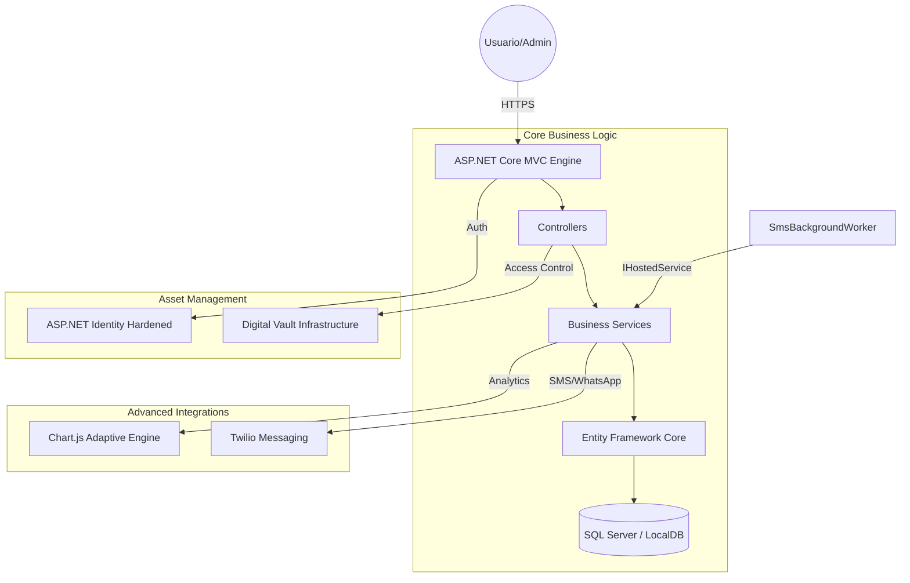

# 📚 BibliotecaMVC: Centro de Gestión Bibliográfica de Vanguardia

[](https://dotnet.microsoft.com/download)
[](https://docs.microsoft.com/ef/)
[](file:///c:/Repos/BibliotecaMVC)
[](file:///c:/Repos/BibliotecaMVC)

**BibliotecaMVC** es una plataforma de gestión bibliotecaria de alta gama que redefine la experiencia de préstamo digital. Diseñada bajo un estándar de **Estética Industrial**, integra analíticas avanzadas, un motor de lectura inteligente de última generación y una arquitectura de seguridad robusta para el manejo de activos digitales.

---

## ✨ Características Premium

### 🎨 1. Estética Industrial y UX Adaptativa
*   **Diseño de Vanguardia**: Implementación de **Glassmorphism** (Efecto Cristal) en tarjetas de libros para una profundidad visual superior.
*   **Modo Oscuro Dinámico**: Interfaz 100% armonizada. Los colores, sombras y componentes se adaptan orgánicamente a las preferencias del sistema.
*   **Diferenciación de Interacción**: Jerarquía visual clara entre "Acciones" (botones sólidos, `rounded-3`) y "Estados" (badges de cápsula, traslúcidos), eliminando cualquier carga cognitiva para el usuario.

### 📊 2. Inteligencia de Negocio y Analíticas
*   **Insights en Tiempo Real**: Dashboards administrativos potenciados por `Chart.js` con visualización adaptativa (textos y grillas inteligentes para modo oscuro).
*   **Tendencias de Préstamos**: Análisis gráfico de la actividad mensual para la toma de decisiones basada en datos.
*   **Control de Morosidad**: Monitorización visual de deudas y días de mora mediante gráficos de barras horizontales de alto impacto.
*   **Curaduría de Contenido**: Gráficos circulares de los libros más populares para identificar los intereses de la comunidad.

### 📖 3. Smart Reading Engine (Motor de Lectura)
*   **Visor Inmersivo**: Experiencia de lectura fluida a pantalla completa diseñada para máxima concentración, eliminando distracciones de navegación global.
*   **Persistencia de Progreso**: El sistema guarda automáticamente la página exacta donde te quedaste, permitiendo una continuidad total entre dispositivos.
*   **Streaming de Activos**: Soporte multiformato (PDF, EPUB, DOCX) servido mediante streaming seguro desde un **Vault** protegido.

### 🛡️ 4. Infraestructura de Seguridad Industrial
*   **Protección Digital (Vault)**: Los archivos originales están aislados de la carpeta pública; solo usuarios con un préstamo activo y validado pueden leer o descargar.
*   **Validación de Negocio**: Control estricto de límites de préstamo (Máx. 3), prevención de multas pendientes y bloqueos automáticos por morosidad.
*   **Seguridad Ofensiva**: Blindaje contra ataques de **IDOR** y **CSRF**, junto con un sistema de Identity endurecido.

---

## 🏛️ Arquitectura del Ecosistema



---

## 🛠️ Stack Tecnológico
*   **Backend**: C# 12, ASP.NET Core 8.0+, Entity Framework Core.
*   **Frontend**: Bootstrap 5 (Custom Premium Utility), JavaScript ES6, CSS Variables (Dynamic Theme).
*   **Analíticas**: Chart.js con configuraciones de contraste adaptativas.
*   **Cloud & Mensajería**: Twilio SMS API para notificaciones transaccionales.

---

## 💻 Guía de Despliegue y Configuración

### 1. Gestión de Secretos
El sistema protege tus credenciales críticas mediante `dotnet user-secrets`. Configura tus llaves antes de iniciar:

```powershell
# Iniciar gestión de secretos en el proyecto
dotnet user-secrets init

# Configuración Administrativa
dotnet user-secrets set "AdminSettings:Email" "admin@bibliotecamvc.com"
dotnet user-secrets set "AdminSettings:Password" "TuPasswordSeguro123!"

# Configuración Twilio (SMS/Notificaciones)
dotnet user-secrets set "TwilioSettings:AccountSid" "ACXXXXXXXXXX"
dotnet user-secrets set "TwilioSettings:AuthToken" "tu_token_aqui"
dotnet user-secrets set "TwilioSettings:FromPhoneNumber" "+123456789"
```

### 2. Inicialización del Ecosistema
```powershell
# Actualizar base de datos con migraciones de EF
dotnet ef database update

# Ejecutar el servidor de desarrollo
dotnet run
```

---

## 📁 Estructura de la Solución
*   **Controllers/**: Orquestación de flujos (Préstamos, Admin, Multas).
*   **Services/**: Lógica de pesada y servicios externos (SMS, Lectura).
*   **ViewComponents/**: Widgets de UI reutilizables y reactivos.
*   **BibliotecaLibros_Vault/**: Repositorio físico protegido de activos (fuera de wwwroot).

---

> [!IMPORTANT]
> **Aviso de Cumplimiento**: Este software implementa validaciones de integridad de datos en cada capa para asegurar una experiencia de usuario robusta y sin excepciones imprevistas.

*Desarrollado con arquitectura premium y pasión tecnológica.*
